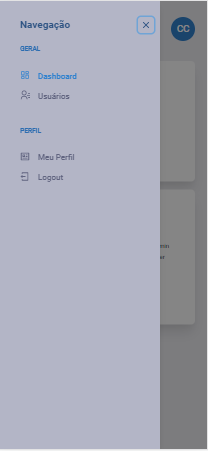
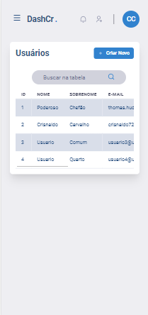

<h1 align="center">
    
</h1>

<p align="center">
  <a href="https://www.crisnaldocarvalho.com.br">
    
  </a>

  

  

  

</p>

## Descrição:

<p>
Aplicação front-end em ReactJS como parte de processo seletivo que tem por objetivo um gerenciamento de usuários.</p>
<p>
Com base no desafio proposto, como solução foi projetado e desenvolvido uma aplicação com dashboard de controle de usuários, a ideia de interface já ahavia utilizado em um projeto de estudo em um curso de especialização em React, porém foi remodelada e com novas funcionalidades para esta tarefa. Assim surgindo o DashCr . (Dashboard Controlador de Recursos).

## Executando o projeto

Após clonar o repositório,entrar na pasta raiz do projeto e instale as dependências com os comandos abaixo via terminal:

```js
cd dash-cr
yarn install
```

Com o terminal ainda na pasta raiz do projeto, execute o comando:

```js
yarn start
```

Outra opção disponível para executar o projeto é através do Docker. Tendo o mesmo devidamente intalado na sua máquina, abra o terminal na pasta raiz do projeto e execute o comando:

```js
docker-compose up -d --build
```

Esse docker tem foco no desenvolvimento, portanto há um compartilhamento do volume node_modules para uso no container, estando sempre refletindo o estado atual do projeto.

Após executar uma das duas formas de execução do projeto, o mesmo se encontrará no endereço http://localhost:3000/ .

Para logar na plataforma use um dos usuários presentes no Mirage Mock que se encontra na seção de decisões técnicas.

## Homologação

Com o uso do MirageJs, ao qual o mock acompanha a aplicação, foi realizado uma Action de Deploy automático para o Firebase Hosting. E a aplicação pode ser acessada através do link: <br/>

<p align="center">
<a href="https://dash-cr.web.app/" target="_blank">https://dash-cr.web.app/</a>
</p>

## Decisões Técnicas

Utilizei esse projeto como além do desafio proposto um desafio pessoal de utilizar coisas mais recentes, as quais venho estudando.
O projeto foi iniciado com Create React App e typescript.
Como biblioteca de UI, foi utilizada o <a href="https://chakra-ui.com/" target="_blank">Chakra UI</a>. A ideia foi aplicar interfaces declarativas, que consiste em manter a estilização junto do código JSX, e diferente dos concorrentes Material, Bootstrao, Reactstrap, o Chalra não impõe um padrão de aplicação/estilização. Trazendo Hooks para tratamento de brakpoints, entre outros, facilita a confecção de interfaces responsivas e calculadas. O ponto negativo desse tipo de interface é a verbosidade do código, que é sanado com a quebra em componentização, que auxilia na manutenção do código e nos testes do mesmo, por isso foi escolhida essa abordagem para este projeto.

Para o mock http foi utilizado o <a href="https://miragejs.com/" target="_blank">MirageJs</a>. Elém provém um middleware na própria aplicação, o acesso a API mockada é feito pela propria url da aplicação com uso de um namespace ('/api' usado no DashCr). As chamadas feitas são interceptadas e listadas no console da aplicação. Como benefício, não há necessidade de execuções externas para usar o mock, ele fica integrado na aplicação. Permitindo até que seja usada em homolog como foi o caso. As novas informações se mantém persistidas até a aplicação ser atualizada ou reiniciada. No inicio do mock serão carregados os dados abaixo:


Comportamentos da interface, como no sidebar, foi utilizado ContextAPI.
Para uso e disparo das chamadas a Api foi usado Redus Sagas implementado com Toolkit.
Para os testes foi utilizado Testing Library.
React Hook Form para validação de formulários.

### Tenologias:

- React JS
- Typescript
- ChakraUI
- MirageJs
- React Hook Form
- Testing Library
- React Table
- Axios
- ContextAPI
- ReduxJSToolkit
- Redux Sagas
- Firebase
- Docker

## Screenshots

### Desktop


### Mobile Responsivo





